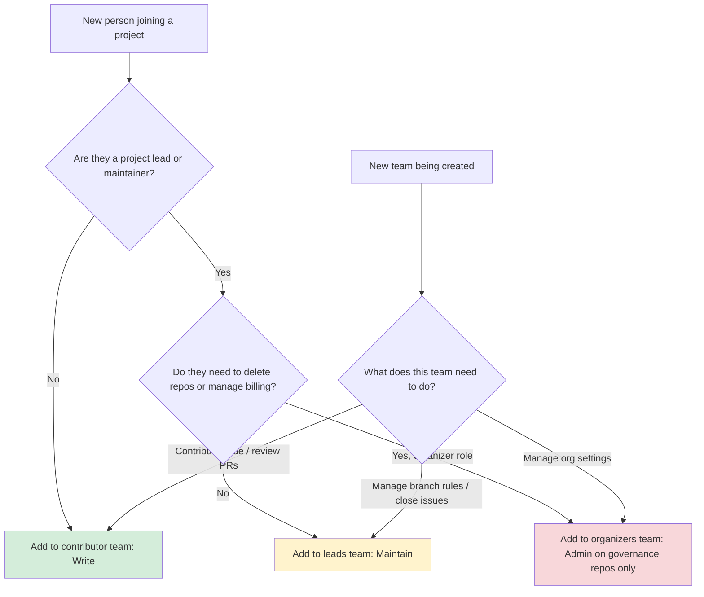

# Branch Protection and CODEOWNERS Guidance

## Goals

- Give every repository an explicit review path so contributors know who approves changes.
- Keep review load on project teams, not the organizers — each project owns its own merge gates.
- Provide consistent guardrails (branch protection, required checks) that match CivicTechWR's volunteer-friendly workflow.

## Team-Based Access Model

**All repository access must be granted through teams, not directly to individual users.** Direct user-to-repo assignments bypass the team governance model, are invisible in team audit views, and create stale access when contributors rotate off.

### Permission Levels

| GitHub Permission | Plain-English meaning | Who gets it |
|------------------|----------------------|-------------|
| **Read** | You can see everything, open issues, leave comments — but not touch code | Anyone browsing or giving feedback |
| **Triage** | Read + you can label/close issues and PRs, but still can't push code | Community managers, issue shepherds |
| **Write** | You can push branches, open PRs, review and merge PRs (if branch protection allows) | All active project contributors |
| **Maintain** | Everything Write + you can change branch protection settings, close stale issues, push to protected branches in an emergency | Project leads |
| **Admin** | Full control: settings, delete the repo, manage who has access, change billing | `@CivicTechWR/organizers` only, on governance repos |

**Maintain is the right permission for project leads.** It covers all day-to-day lead responsibilities without the nuclear options — deleting the repo, changing billing, or modifying org-level settings. Any team named `*-leads` or `*-admins` should use Maintain, not Admin, unless there is a specific documented reason otherwise.

### Which permission should I assign? (Decision Guide)



### Setting Up a New Project Team

1. Create a contributors team: `your-project-team` with **Write** permission
2. If leads are identified, create: `your-project-leads` with **Maintain** permission
3. Add the team(s) to the repository — do not add individual users directly
4. Remove any existing direct user-to-repo assignments once team coverage is confirmed
5. Add a `CODEOWNERS` file pointing to the team (see below)

### Removing Direct User Assignments

To check whether a repo has any direct assignments:
```bash
gh api repos/CivicTechWR/REPO/collaborators?affiliation=direct --jq '.[].login'
```
If the list is non-empty and those users are already covered by a team, remove the direct grants:
```bash
gh api repos/CivicTechWR/REPO/collaborators/USERNAME -X DELETE
```
Do not remove a direct assignment until the user's team membership is confirmed — removing it without team coverage will cut off their access entirely.

---

## How CODEOWNERS Works in This Organization

**Important:** GitHub does not propagate a `CODEOWNERS` file from the org-level `.github` repository to other repositories in the organization. The `CODEOWNERS` file in this repository protects only *this* repository.

Every project repository that wants code-owner enforcement must commit its own `CODEOWNERS` file. The organizers team intentionally does not act as a default reviewer across the whole org — that would create a bottleneck on a volunteer team. Instead, each project team manages its own review requirements.

## Recommended Branch Protection Defaults

Apply these settings to each repository's default branch (Settings → Branches → Add branch protection rule). Individual repos can tighten the requirements, but should not weaken them without organizer sign-off.

1. **Target branches:** `main` (and `master` for legacy repositories).
2. **Require a pull request before merging.**
3. **Required reviewers:**
   - At least **1 approval** from a team member, prefer **2 approvals** for active codebases.
   - **Require review from Code Owners** once the repo's own CODEOWNERS file is in place.
4. **Status checks:** enable the project's primary CI build (e.g., `lint`, `test`, `deploy-preview`). Add checks before the first release; don't require checks that don't exist yet.
5. **Additional safeguards:**
   - Require conversation resolution before merging.
   - Require linear history.
   - Allow force pushes only for administrators handling emergency fixes.
   - (Optional) Require signed commits if the project already enforces them.
6. **Administrator enforcement:** keep the rule enforced for admins to prevent accidental direct pushes. See the break-glass procedure below for emergencies.

Review the branch rule quarterly to confirm the status check list matches reality and that teams still have capacity for review.

## Setting Up CODEOWNERS for a Project Repository

Create a `CODEOWNERS` file in the repository root. Assign your project team as the owner, and optionally loop in the organizers for governance-sensitive paths.

### Minimal template

```text
# Primary reviewers — replace with your project team
* @CivicTechWR/your-project-team
```

### Extended template (recommended for active projects)

```text
# All files — project team reviews code changes
* @CivicTechWR/your-project-team

# Workflow and governance changes also notify organizers
/.github/workflows/** @CivicTechWR/your-project-team @CivicTechWR/organizers
/docs/**              @CivicTechWR/your-project-team @CivicTechWR/organizers
```

Key considerations:

- GitHub evaluates CODEOWNERS patterns from top to bottom; the last matching pattern wins. Specific paths below the wildcard `*` will override it.
- Check whether your repository already contains a CODEOWNERS file before creating one to avoid accidental duplicate entries.
- Keep at least one organizer on workflow and governance paths so the org maintains visibility without owning the whole review queue.

## Organization Teams Snapshot

| Team | Status | Scope / Suggested Repositories |
| --- | --- | --- |
| `@CivicTechWR/organizers` | Active | Governance repos: `.github`, `CTWR-Organization-Documentation`, `CTWR-Docs`. Fallback reviewer for repos without a dedicated team. |
| `@CivicTechWR/website` | Active | `ctwr-web`, `CTWR-Website`, `blog`. |
| `@CivicTechWR/wrvotes` & `@CivicTechWR/wrvotesiteadmin` | Active | Election assets: `WRvotes`, `WRVotesPlaceholder`, `WRVotesMunicipal2022`, `WRVotesProv2025`, `WRVotesFed2025`, `WRVotesFed`. |
| `@CivicTechWR/go-train-pass-project-team` | Active | `go-train-group-pass`. |
| `@CivicTechWR/connected-kw` | Active | `connectedkw`. |
| `@CivicTechWR/midtown-radio-app` | Active | `MidtownRadioApp`, `midtown-radio-launch-2025`. |
| `@CivicTechWR/project-ploughshares-dev-team` & `@CivicTechWR/project-ploughshares-leads` | Active | `project-ploughshares`. Dev team handles code; leads handle partner coordination. |
| `@CivicTechWR/zonechanges` | Active | `WaterlooZoneChangeRequests`. |
| `@CivicTechWR/ctwr-member-directory` | Active | `ctwr-member-directory`. |
| `@CivicTechWR/project-pech` | Proposed | `project-pech`. Seed with `j2fyi` and an organizer for continuity. |
| `@CivicTechWR/mappingwr` | Proposed | `mappingwr`, `municipal-engagement`. |
| `@CivicTechWR/storytelling` | Proposed | `storytelling`. |
| `@CivicTechWR/project-templates` | Proposed | `CTWR-ProjectTemplate`, `CTWR-Project-Template-New`, `CTWR-Template`, `CTWR-Docs`. |
| `@CivicTechWR/improved-housing` | Proposed | `improved_housing_portal`. |

Projects without a dedicated team fall back to `@CivicTechWR/organizers` as reviewers until their team exists and their repo has its own CODEOWNERS file. Organizers should create teams when projects become active and revisit this table quarterly.

## Implementation Checklist

1. **Create teams before adding people.** Never add a user directly to a repo. Create (or identify) the appropriate team first.
2. **Apply the right permission level.** Contributors → Write. Leads → Maintain. Do not use Admin for project teams.
3. **No direct user assignments.** Verify the repo has no direct collaborators (`Settings → Collaborators → Direct access`). If it does, confirm team coverage first, then remove the direct grants.
4. **Add a CODEOWNERS file to each active project repo.** Use the templates above. Do not rely on the organizer-level `.github` file — it does not propagate.
5. **Update branch protection per repo.** Apply the recommended rule to each repository's default branch.
6. **Communicate the change.** Post in `#organizers`, update `CTWR-Organization-Documentation`, and mention during the weekly meetup.
7. **Track coverage.** Open an issue to track which repos still lack a CODEOWNERS file and invite project teams to add their own.

## Break-Glass Procedure

When a merge is blocked by branch protection and normal review is unavailable (e.g., a Copilot-authored PR whose author cannot self-approve, or a time-sensitive fix with no available reviewer):

1. Confirm the change has been reviewed by at least one person with context, even informally (Slack, in-person).
2. Temporarily disable `enforce_admins` via the GitHub API or Settings:
   ```bash
   gh api repos/CivicTechWR/REPO/branches/main/protection/enforce_admins -X DELETE
   ```
3. Merge with admin privileges:

   > **Note:** `--admin` overrides *all* branch protection rules including required CI checks (gitleaks, lint, tests). Before using it, manually confirm the change has been reviewed and the gitleaks scan has passed on this branch.

   ```bash
   gh pr merge NUMBER --admin --merge
   ```

   > **If the merge fails:** Run step 4 (re-enable `enforce_admins`) immediately before investigating the failure. Do not leave branch protection disabled while you troubleshoot.

4. Re-enable `enforce_admins` immediately after:
   ```bash
   gh api repos/CivicTechWR/REPO/branches/main/protection/enforce_admins -X POST
   ```
5. Post a note on the merged PR explaining why the break-glass was used.

Do not use this procedure to skip security or compliance reviews.

## Maintenance Cadence

- **Quarterly:** Review team membership, permissions, and branch protection rules across active repos.
- **Season kickoff:** Confirm each active project's CODEOWNERS file lists current maintainers.
- **After project sunset:** Archive the repo or revert CODEOWNERS to organizer-only ownership to avoid stale reviewers blocking future changes.

## Risks and Pitfalls

- **Direct user assignments bypass team governance:** Adding users directly to repos instead of via teams makes them invisible to team-level audits and creates stale access that persists after someone leaves a project. Always use teams.
- **CODEOWNERS does not auto-propagate:** Repos without their own CODEOWNERS file have no code-owner enforcement, regardless of what this governance repo contains.
- **Stale team membership:** CODEOWNERS blocks merges when listed reviewers are inactive. Reconfirm rosters every quarter and any time a maintainer steps back.
- **Automation permissions:** Workflows that create teams or modify permissions require an organization-level Personal Access Token with `admin:org`; keep the token scoped and rotate it periodically.
- **Copilot-authored PRs:** GitHub prevents the user who prompted a Copilot agent from self-approving the resulting PR, even with admin override and `enforce_admins` enabled. Use the break-glass procedure above and ensure a second set of eyes reviews the change.
- **Archived or legacy repos:** Election archives may still receive security updates. Confirm whether they need active CODEOWNERS or should be fully archived to remove review pressure.
